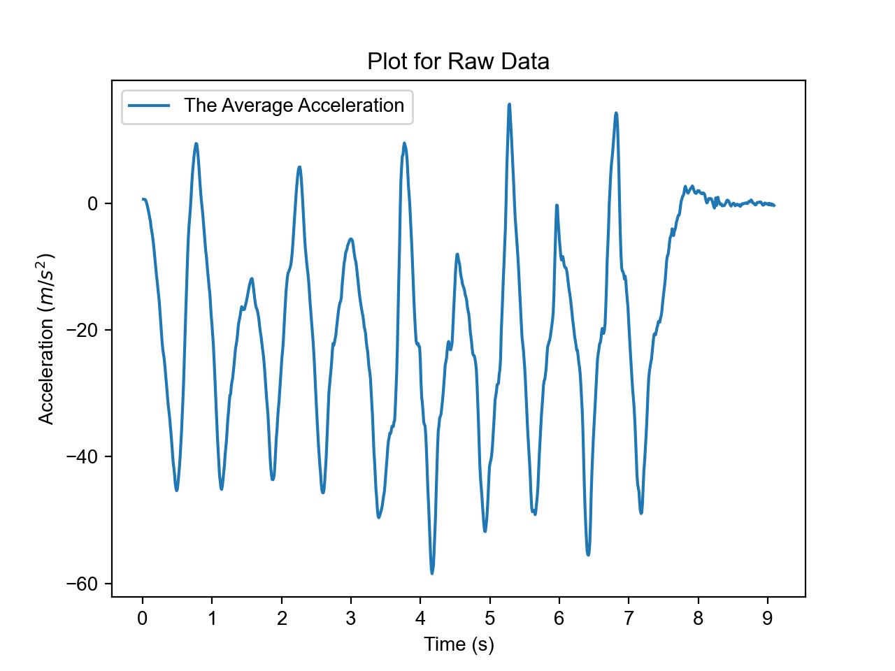
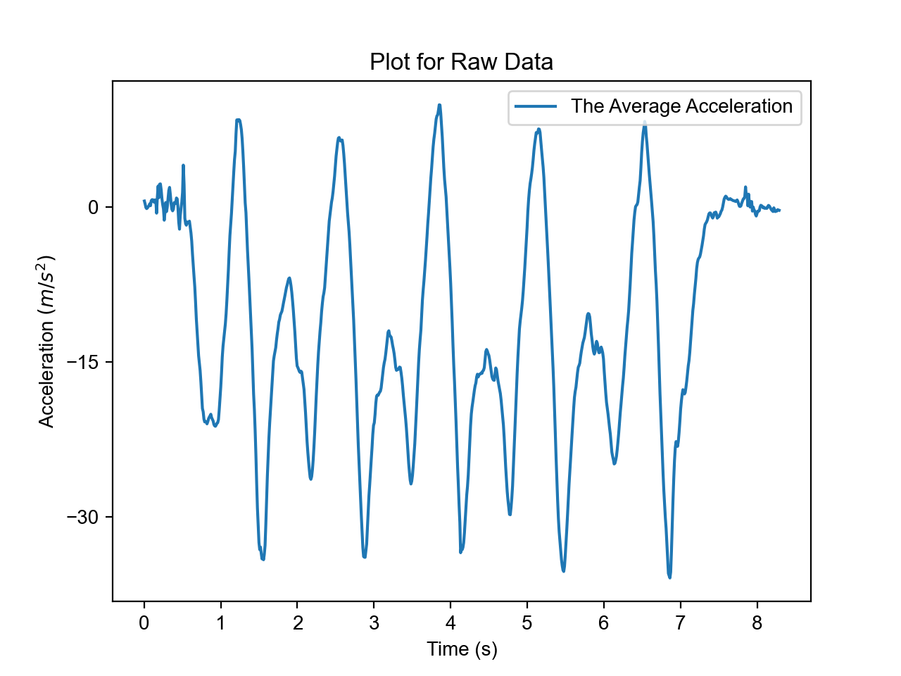
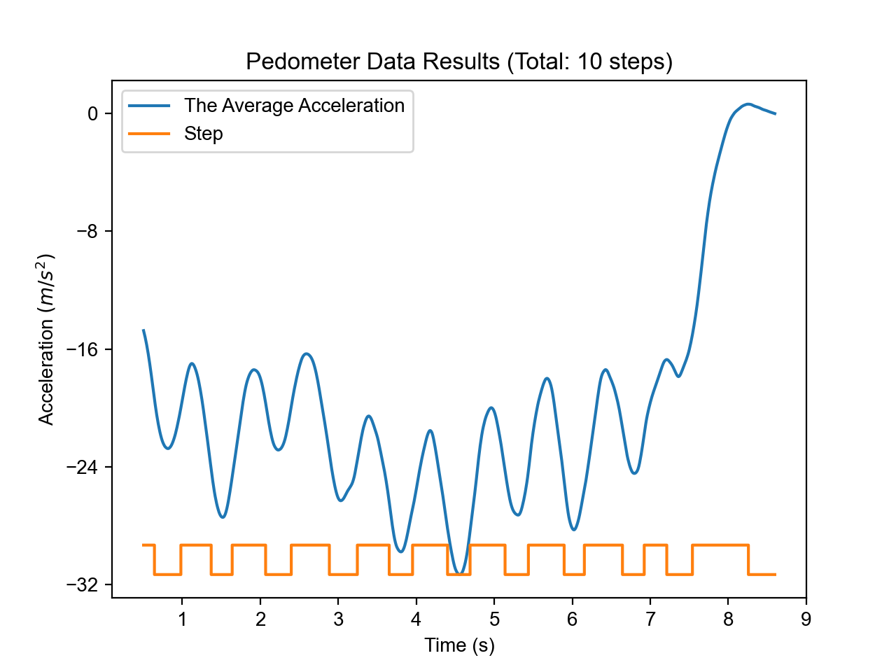
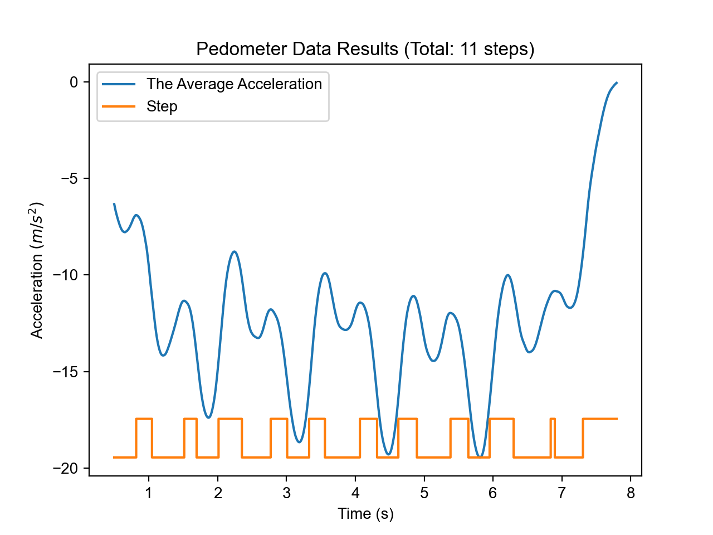

# The Pedometer Algorithm

A Python program for counting steps using just smartphones sensor data. It includes both an analysis component (for off-line data analysis) and a visualization component for the data.

This program is tested in real-world datasets with a 90% accuracy. The project is built with Python, Pandas, Numpy, and Matplotlib. It is created during the Engineering Interactive Technologies course at UVA.

## Set up

- To set up the project, simply install the dependencies: `pip install -r requirements.txt`
- Alternatively, install the two dependencies manually: `pip install pandas matplotlib`.

## Output

Below are the visualization of 2 sample datasets. Both of them were collected by team members by walking 10 steps in the hall way, while collecting data using their smartphone sensors. 

  
&nbsp; &nbsp; &nbsp; &nbsp;
  

After cleaning the sensor data, we generated the following plots. 

Clearly, after the signal processing, the curves are much more smooth compared to the previous ones. Additionally, the algorithm detected the steps with a ~90% accuracy, as shown in the yello step curve.

  
&nbsp; &nbsp; &nbsp; &nbsp;
  

## License
MIT License

